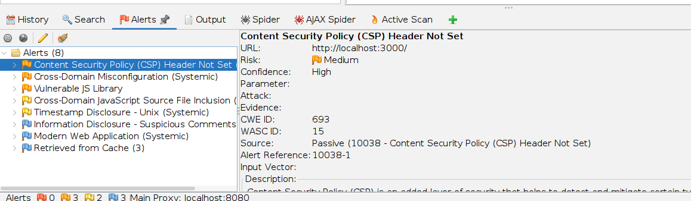
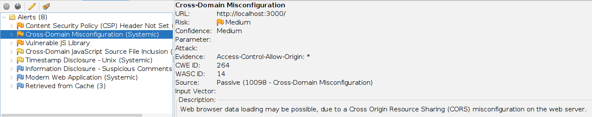
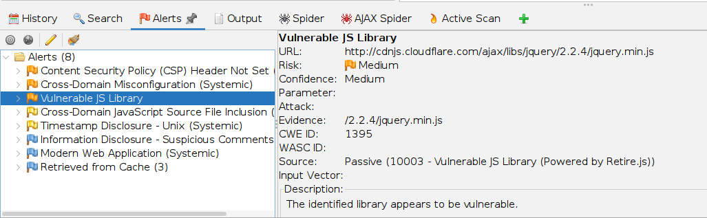
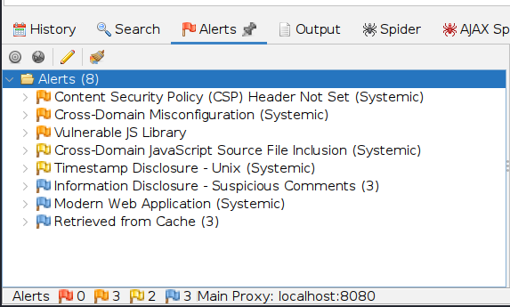

# FUTURE_CS_01
Internship Project | Web Application Security Testing
## 📝 Project Overview
This repository documents a comprehensive vulnerability assessment of the **OWASP Juice Shop**. The goal was to simulate a professional client engagement by utilizing ethical hacking tools to identify security flaws in the web application, aligning them with the **OWASP Top 10 framework** and developing actionable remediation strategies.

## 🛠️ Tools & Environment
* **Target:** OWASP Juice Shop (Vulnerable Web App)
* **Scanner:** OWASP ZAP (Zed Attack Proxy)
* **Methodology:** DAST (Dynamic Application Security Testing)
* **Lab Environment:** Localhost / Isolated Docker Container
* **Standards:** OWASP Top 10 Framework

---

## 🔍 Key Findings & Evidence

### 1. Missing Content Security Policy (CSP) Header
**Risk:** Medium | **OWASP Category:** Insecure Design (A06:2025)

The application lacks a CSP header, a vital "Defense-in-Depth" mechanism. Without it, the site is significantly more vulnerable to **Cross-Site Scripting (XSS)** and data injection attacks.

  
📸 Click to view screenshot evidence

   
  

### 2. Cross-Domain Misconfiguration
**Risk:** Medium | **OWASP Category:** Broken Access Control (A01:2025)

The server is configured to allow access from any origin. This misconfiguration can allow unauthorized domains to interact with the application, potentially leading to sensitive data exposure.

  
📸 Click to view screenshot evidence

   
  

### 3. Vulnerable JavaScript Library
**Risk:** Medium | **OWASP Category:** Software Supply Chain Failures (A03:2025)

The assessment identified the use of outdated JavaScript libraries with known vulnerabilities (CVEs). Attackers can exploit these known flaws to execute arbitrary code or bypass security controls.

  
📸 Click to view screenshot evidence

   
  

---

## 📊 Summary Snapshot
Below is the snapshot of the scanner output obtained during the assessment:

  
📊 Click to view ZAP Scanner Output

   
  
  
<i>Figure: Breakdown of alerts by severity as identified by OWASP ZAP.</i>

Figure 1: Automated scan results identifying security gaps within the application.

---

## 📁 Project Deliverables
* [**Detailed Security Report (PDF)**](./Security_Assessment_Report.pdf) - My executive summary and deep-dive analysis.
* [**OWASP Top 10 Checklist**](./OWASP_Top_10_Compliance_Checklist.xlsx) - Mapping findings to industry-standard benchmarks.
* [**Automated Scan Logs**](./Logs/2025_12_29_ZAP_Report.pdf) - The raw output from the OWASP ZAP engine.

---

## 💡 Professional Growth
This project sharpened my skills in :
* **Risk Mapping:** Connecting technical vulnerabilities to the OWASP Top 10.
* **Tool Proficicency:** Leveraging DAST tools for efficient security baseline testing.
* **Technical communication:** Documenting findings for stakeholders.

---
**Thank you for visiting my project! Feel free to connect with me on [LinkedIn](https://www.linkedin.com/in/deborah-adekanye) to discuss about cybersecurity.**
